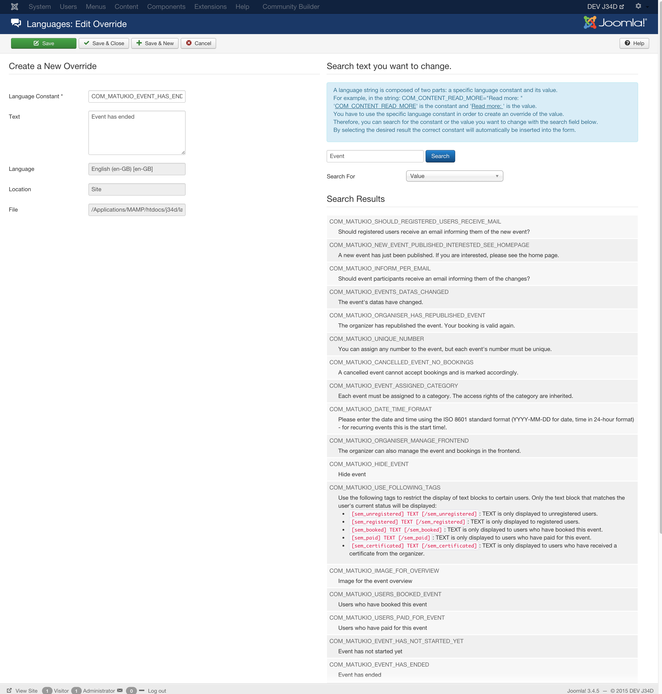

# How to change texts in Matukio (Language Overrides)

Joomla offers a great feature to change all kind of texts and this in different languages. 

Just navigate to:

Extensions
-> Languages 
-> Overrides

Click on "New" and search for the text you want to replace. Just set the new text (for frontend and backend) and click on "Save" afterwards.

You can find more information on Joomla language overrides [here](https://docs.joomla.org/J3.x:Language_Overrides_in_Joomla).

