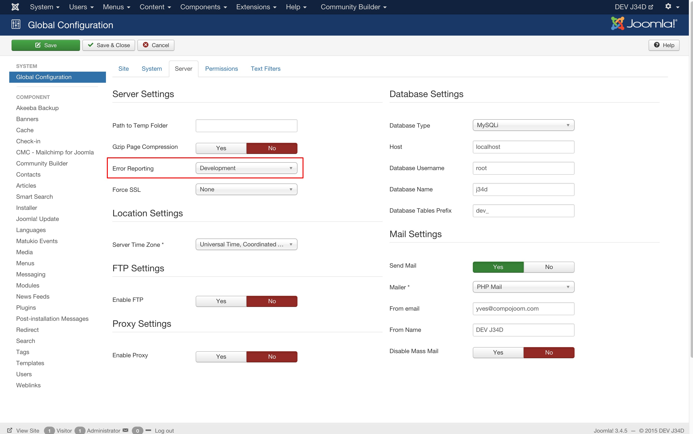

# Blank Page 

Whenever you try to open a page with an PHP error (500 for example) and error reporting is set to none you receive a blank page with no content.

Before posting a ticket please apply the following steps to get an error message:

1.) Navigate to the Joomla global configuration in the backend and set Error reporting to Development.

2.) Enable Joomla Debugging in the system tab too.

After that you should receive an readable error message.

As an alternative you can check the php error logs (if logging is enabled).

