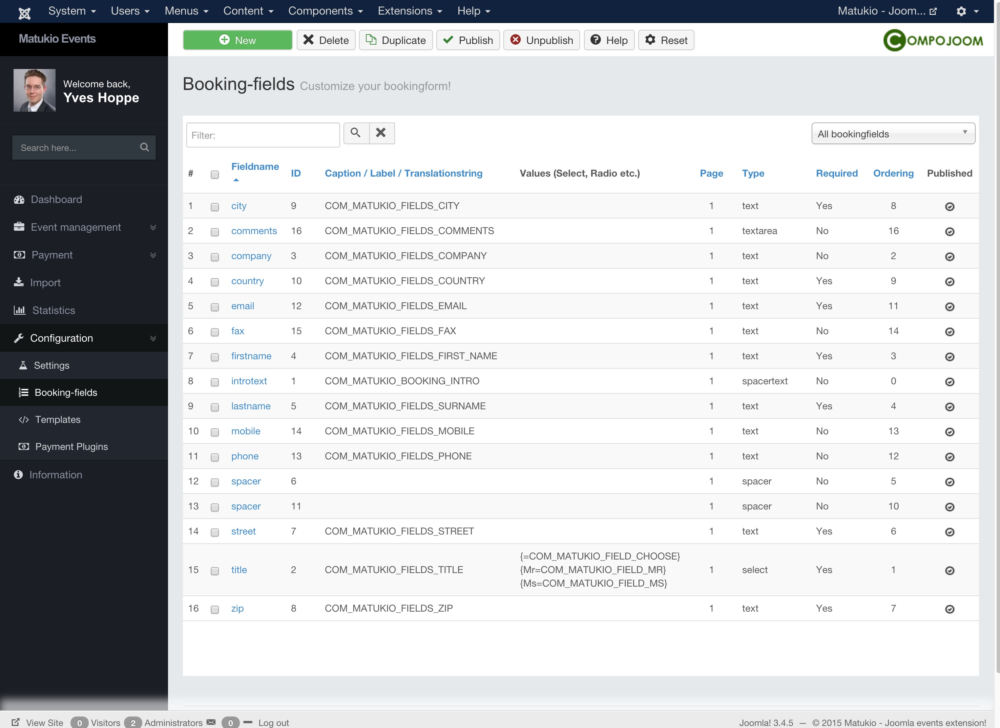

# Booking fields (Administrator)

In Matukio Events there are two types of booking fields:

**Global ones**, which are displayed on every booking form

AND

**Event specific ones**, which are only shown for certain events.

Event specific booking fields are created directly when you edit or create an event.

## Global booking fields

Configuration -> Booking-fields

The booking fields in Matukio are 100% dynamic. This gives you the freedom to completly configure the booking form to your wishes. But this also has some downsides too. Please read through this section before you make any changes.

You can create a new one by just clicking on the "New" button.

> Please don't change the field names for the first name, last name and email address! Else wise Matukio can not allocate names / email addresses any longer.

### Field name

This is the most important setting. This is an intern identifier used for this booking field.

> You don't need to translate this one! As it is used only internally. No special characters and spaces are allowed.