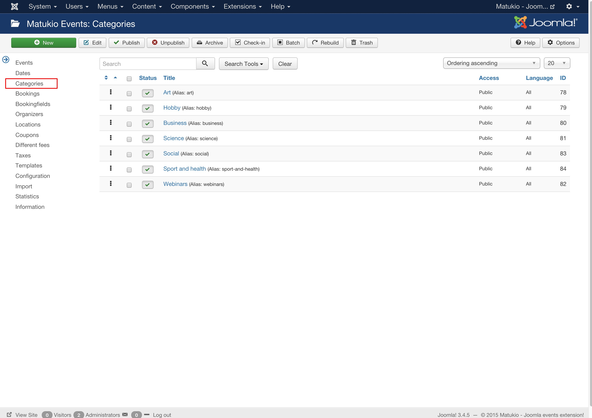

# Categories for Matukio Events (Admin)

Event Management -> Categories

> We use the Joomla! category manager in Matukio Events. Because of this the administrator area of Matukio looks different there.

Creating a category (or multiple) is basically the first thing you need to do after installing Matukio. It's pretty straight forward. 

**Please note:** Only (super-)administrators are allowed to create categories by Joomla default. Because of that this functionality is limited to the Joomla backend in Matukio.

To create a new category just click on "New". The only required field is the title. The Alias is automatically generated depending on the title, but you can also manually define it.

The description is  only shown if you select a **single** category in the event-list overview of Matukio Events.

Joomla access / ACL levels are **completely** supported by Matukio. For example if you set access to registered only logged in users are able to view events in this category.

You can add an category image (which is used when there is no event image) in the Options Tab. It should be in portrait mode and not larger then 600px.

The settings in the publishing tab are currently not used by Matukio. 

