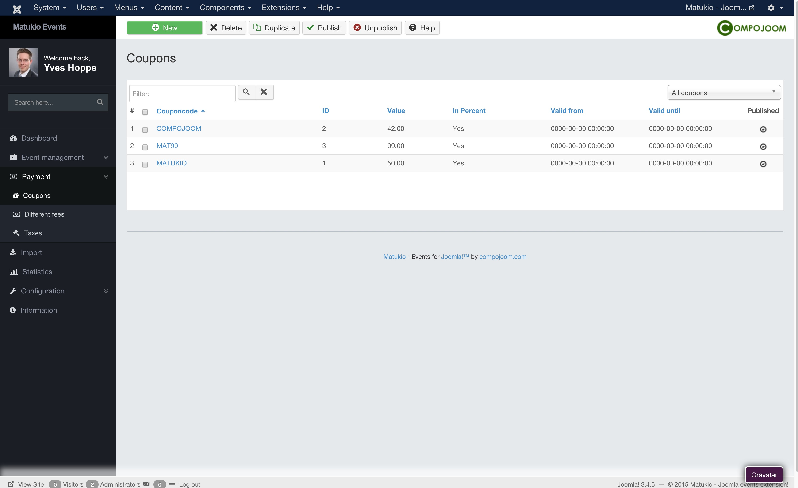

# Coupons (Administrator)

Payment -> Coupons

In this area you can create and manage coupons for your events. These can be entered during the booking.

You can either have a percent or a money value. (e.g. 20 % or 10 $). For percent values you just insert a value from 1 to 100, else just set the money value (No signs, only values!).

You can also limit the coupon usage. (So you can use it only once or X times).

It's also possible to set for how long the coupon should be valid. Just the published up and down date (following the default date format YYYY-MM-DD HH:MM:SS or just use the date picker).

In the details view you can also see how often an coupon code has been used.

> We suggest to only use uppercase words without any special characters for coupon codes.

