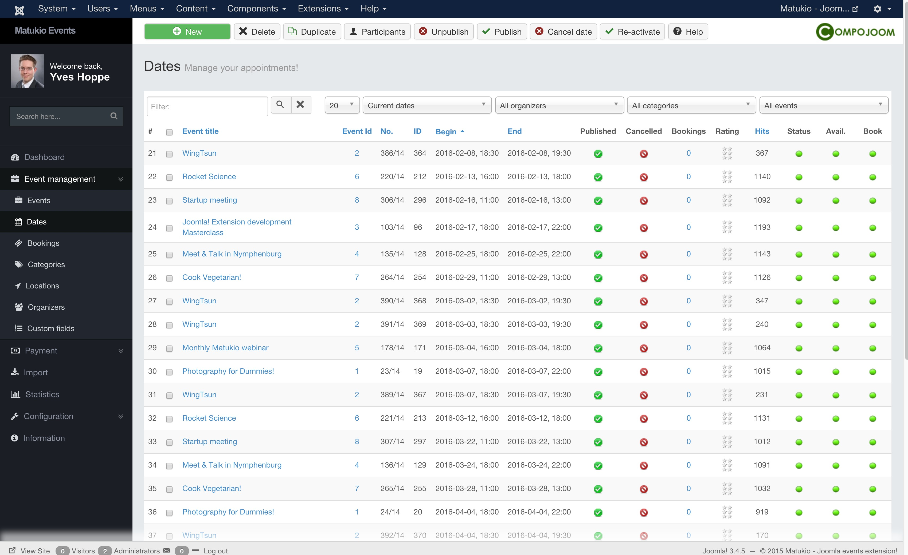

# Dates View (Administrator)

Event Management -> Dates

On this page you can manage the dates for your events or create new ones.

It's a pretty big overview showing a lot of informations.

In the third column you see the Event title for which the date is created. If you click on the title you are redirected to the **date** edit form. One column right you see the event id. When you click on this one, you will be on the **event** edit form.

### Event Number

In Matukio every event has an unique event number, you can define it yourself or use the integrated algorithm. Which uses a continuing number and the year (number/year) the event takes place.

If you don't want to use it just disable it in the settings.

### Cancelled

If you click on the cancel icon, the date for the event is canceled. All participants are informed about this by email (as long as you don't disable this feature in the settings).

### Bookings

The booking columns shows how many active booking are existing for this date. It only counts **active** bookings and not pending, archived or deleted ones. If you click on the number you are redirected to the bookings overview for this date.

### Rating

If you enabled the event rating feature of Matukio you see the current rating of the date here.

### Hits

This shows how many people have visited the event detail page for this event.

### Status

If the status icon is green the event has not started yet. If it is yellow it currently running and if it is red it has ended.

### Available

If the icon is green it is still bookable (seats left). If it yellow new bookings are going to be on the wait-list. If it is red it is fully booked.

### Book

This shows if an date is still bookable or if the closing date is exceeded.
