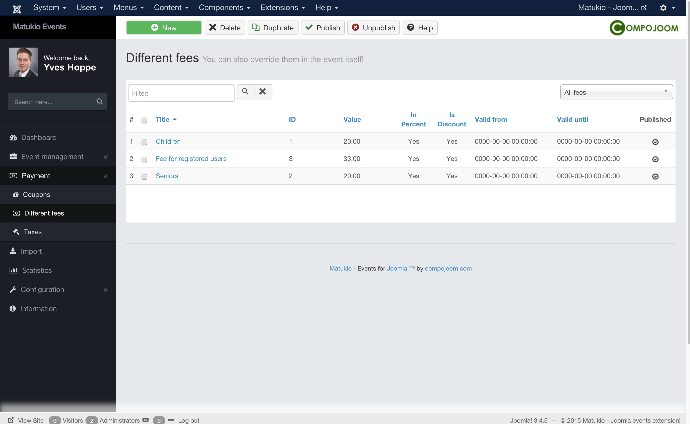

# Different fees in Matukio Events (Administrator)

Payment -> Different fees

Matukio supports different fees for your events. And not only discounts, but also additions.

> There are two type of different fees, global ones for all events and event specific ones. Event specific ones override the global ones.

### Global different fees

> An additional different fee is always calculated in **dependence of the normal event fee**. 

For example: If your event fee is $ 100 and you set up a discounted children ticket with a value of 20 %, the event fee for it will be $ 80.

You can not only setup discount fees but also additions. For example if you want to offer an optional lunch ticket with your event, you set up an additional non perceptual different fee, set discount to No and just insert the lunch price as value.

### In Percent or not?

You can set weather the discount / addition should be in percent or if it should be a real value.

For a percent value just insert a number between 1 and 100 in the value field.

### Group requirement (ACL level)

You can limit certain fees to certain Joomla Access Levels. With this feature you can for example achieve discounts for club members.

### Valid from and until

You can set in which date span the fee should be bookable. Please always fill in both fields, if you want to use this feature.

Date format is as usual: YYYY-MM-DD (2017-12-31)

