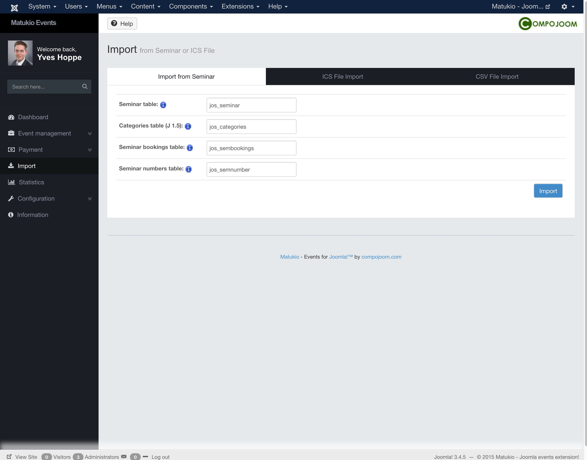

# Import (Administrator)

Matukio offers various import interfaces for events.

### CSV file import

You can find the CSV template file in the media/com_matukio/assets folder of your Joomla installation. (There is also a link on the import dialog).

CSV files are pretty straight forward, if you use the template file, you don't have to make any changes to the settings. Just pick the file and click on import. Make sure there are no breaking quotes (") in the text / data you try to import or you need to escape them before.

> Please make sure you are using the same charset for the CSV file as your database. Probably UTF-8!

### ICS file import

You can easily import events from an ICS calendar file (version 2).

The event data is mapped the following way:

* Event title = VEVENT SUMMARY
* Brief description = SUMMARY
* Place = LOCATION
* Description = DESCRIPTION
* Begin = DTSTART
* End = DTEND
* Closing = DTSTART
* Category = Set in the import dialog
* Updated = Current date
* Publishdate = Current date
* Publisher / Organizer = Current user

###Seminar Event Manager Import

Since Matukio 2.2 you can import old events, bookings and categories from Seminar. 

You just have to set the old Joomla 1.5 seminar tables (have to be on the same database) and the old Joomla 1.5 category table!

Copy the seminar tables and the Joomla category table to the same database your current Joomla installation uses.

### Event Booking Import
Since Matukio 5.3 you are now able to easily import your event data from the joomla component [Event Booking](http://joomdonation.com/joomla-extensions/events-booking-joomla-events-registration.html). The Event Booking importer is able to import your events, categories, locations, currencies, coupons, templates and bookings. We've tried to mkae the import as straight forward as possible. However due to some differences between Event Booking and Matukio Events we are not able to import everything 1:1. So after you do the import you'll need to check the result and confirm that it meets your expectations. Below you can find some information on how the importer works and what you need to be careful of. 

#### Booking fields mapping
We aren't able to automatically import your Event booking custom fields. You'll have to manually re-create the custom fields in Matukio. Once you've done this before you can perform the import you will need to map your Event Booking fields to the Matukio booking fields. 