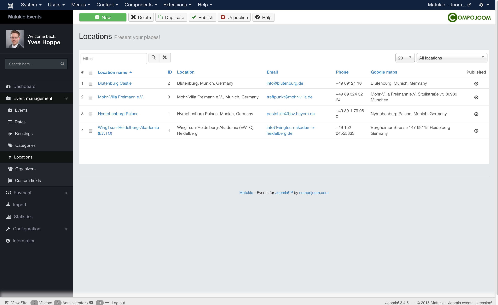

# Locations (Administrator)

Event Management -> Locations

If your events are mostly at the same locations or if you want to have a nice detail page presenting it, this the right spot for you.

They will be automatically linked from the event-list, the event detail page and from many other areas in Matukio. 

You can create a new one by just clicking on New in the overview. 

### Location name vs Location

The location name is a nice text / title, which is mostly used in the frontend as heading.. The Location is shown on areas where we have space. This is mostly a longer one, like Name of location, street, city and country. 

> You can also drag the marker icon to the desired address.

Additionally there is a Google Maps location, which is not shown directly. Please make sure the Maps Marker and the Latitude and Longitude match your location. 

### Latitude and Longitute

They are automatically generated when you insert an Google Maps location or drag and drop the Marker.

### Image

The image is not shown on the detail page, but on some other parts of Matukio Events. Use the description for nice images!

### Description

Use any HTML (including plugin support) you like here to present your location.