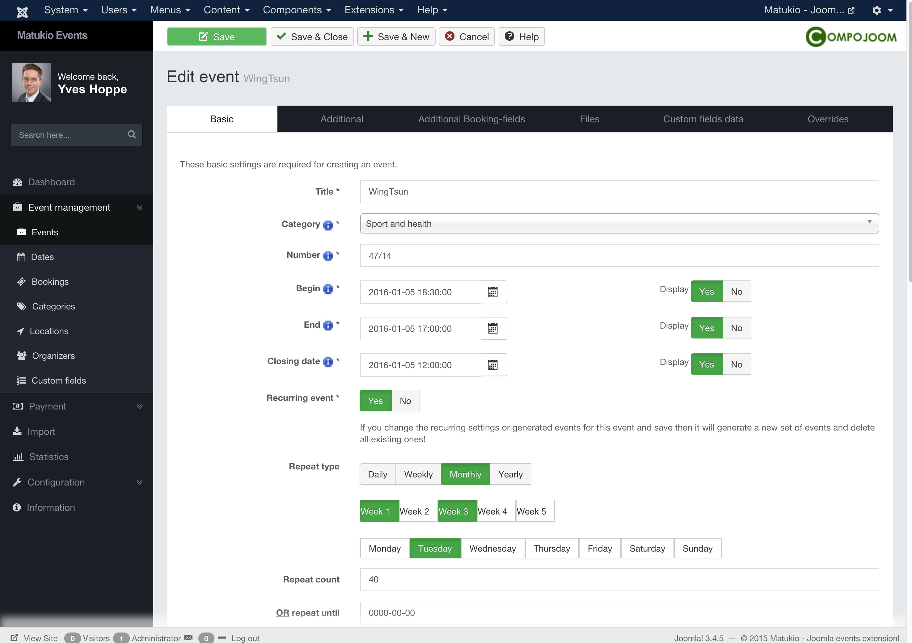

# Create a new Event

Event Management -> Events

> You need to create a category first!

Just click on "New" in the events overview. After this the event creation form will show up (It is the same for editing).

The event creation form can be a bit complex at the beginning as there are a lot of options and settings. But you only need to complete the first page (Fields marked with an Asterisk *) to create an event. Everything else is optional.

The form is divided into 6 different tabs.

## Basic Tab

### Begin, end and closing date

Please insert the dates in the following date format (or just use the calendar):

YYYY-MM-DD HH:MM:SS

2016-01-31 15:01:10

This is the default ISO format of dates and used in all Matukio forms. In the Joomla frontend it is formatted based on your settings in the Matukio configuration.

### Brief description

This one is used for the event-list overview, upcoming events view etc (and for the event detail page if you don't supply a detailed description).

Please be careful with the HTML you use in there as it may break the layout. And you should generally not use more then some lines of text here.

### Location

You can either set an existing location here (if you have created any) or insert a custom location. If you create a webinar you can skip this or insert an URL here.

### Organizer

This is the Joomla user who is going to manage the event and bookings (if he has the required ACL rights for that - core.edit.own / core.create). This user for example also receives a copy of the booking confirmation email.

You can also create nice detail / information pages for organizers.

### Recurring event generator

If you want to set up an recurring event just set the option to "Yes". After this a date generator will show up.

> Please note: If you change the recurring settings of an existing event, all old dates are going to be deleted and are newly generated. Use this option with care! You can edit every date and / or set up new ones in the Dates View.

In it you can select repeating types, the count of dates or how long the dates should be repeated.

After you have set up your recurring settings click on generate. After this a list of dates will show up. You can also edit them manually following the default date scheme: YYYY-MM-DD. Just click on the little x to remove a date.

The span between begin and end of an recurring event is depending on the time between the main begin and end setting of the event itself. The same goes for the closing date. The above begin and end will always represent the first date.

> Please note: You shouldn't generate more then 80-100 dates at once and you can always create new dates later.

## Additional Tab

In the additional section you complement the basic ones. You most probably want to fill some of them too, but they are not required for creating an event.

The 

