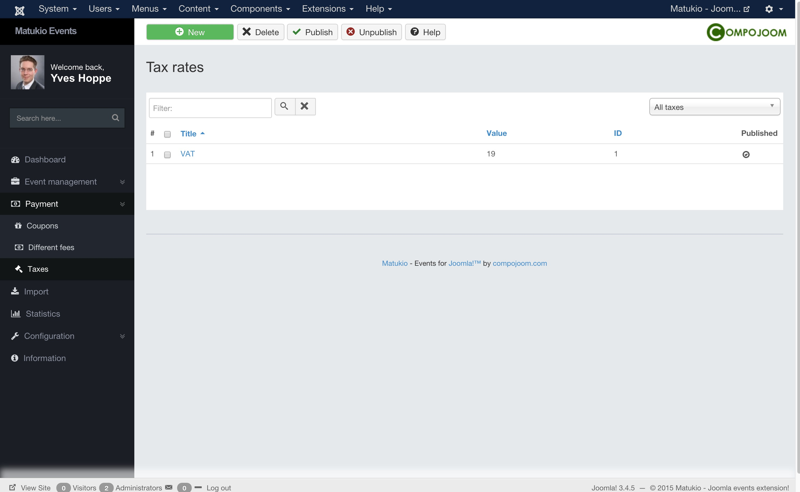

# Taxes in Matukio Events (Administrator)

Payment -> Taxes

Creating taxes in Matukio is pretty straight forward. You just set the percent value (whole numbers), give it a name and you are ready to go.

> Please note: Only one tax per event / fee is possible.

Taxes are automatically calculated! Always enter fees with taxes included. The net value and the taxes are automatically calculated on the gross value!

If you want to show net values there is a setting for this in the Matukio configuration.