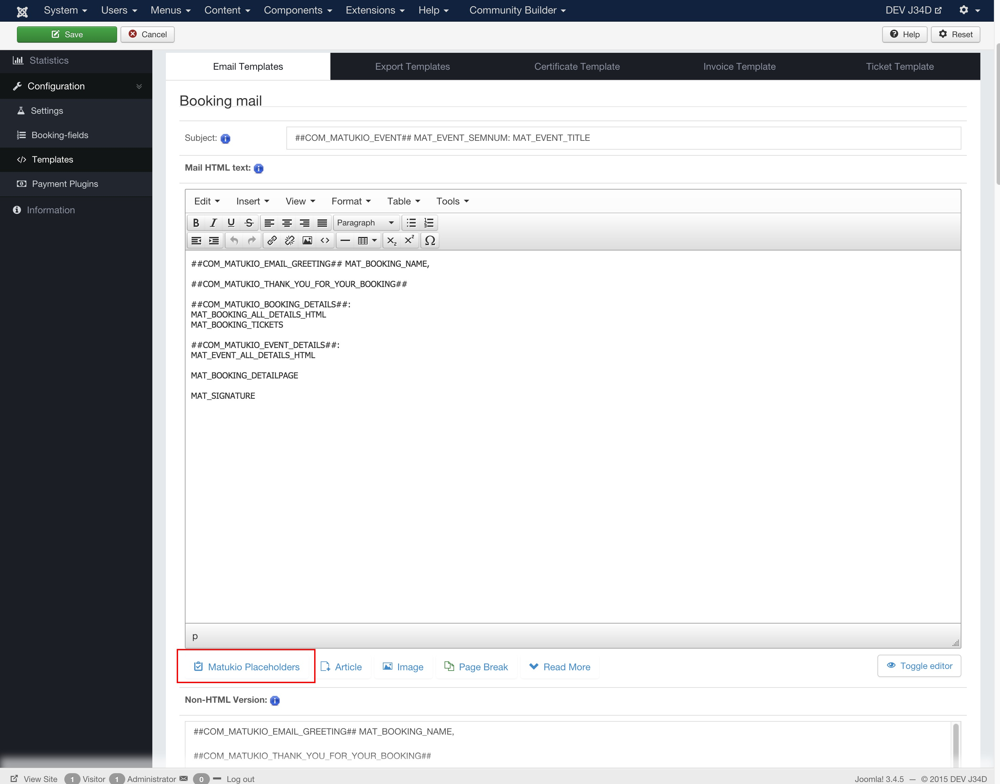

# Templates in Matukio Events (Administrator)

In the templates section you can customize (Text and Design) the outgoing **emails**, **export templates, Invoices, tickets** and **Certificates**. For example the automatic booking confirmation email. 

For templates you can use placeholders (See Chapter 5), which are replaced with the booking / event data.

There are two types of placeholders you can use:

- **Language placeholders**, starting and ending with ##. These will be automatically translated through the Joomla API. For example ##COM__MATUKIO_EVENT## would be event in English. Only for multi-language pages.
 

* **Content placeholders**, starting with MAT_. These will be automatically replaced through an corresponding data value. For example MAT_BOOKING_FIRSTNAME will be replaced through the participants first name.

### Content placeholders

To insert the information from Matukio into your text, you use content placeholders (for example MAT_BOOKING_CITY).

Content placeholders are divided into three different kinds (depending on context).

#### Booking placeholders

Starting with MAT__BOOKING, these are probably the most important for you. Most of them are completely dynamic because they depend on your booking field setup.

MAT_BOOKING_ALL_DETAILS_HTML helps you saving much time, instead of writing every field name, you can use this one to display all booking details.

#### Event placeholders

Starting with MAT__EVENT, these contain the event information. For example MAT_EVENT_TITLE contains the title of the current event.

MAT_EVENT_ALL_DETAILS_HTML does the same for the event data. If you use the NON-HTML version you use _TEXT instead of _HTML.

#### Other placeholders

There also some other placeholders, like MAT_DATE, or MAT_USER_NAME, which contain other data.

MAT_SIGNATURE is replaced through the text given in the Matukio settings. (By default: Please do not answer this E-Mail) - you can change this to anything you like.

> For a full list and more informations just click on the Matukio Placeholders Button below the editor.

## Available Templates

The templates section is divided into five different tabs:

### Email Templates:

Here you can easily customize the most emails, which are sent by Matukio. For example the booking confirmation, which is sent to the user and the organizer, as a confirmation.

If you want you can disable automatic email sending in the Matukio settings. Most email templates are divided into 2 types: 

**HTML** and **Non-HTML** Versions. 

You only have to change the one, according to which E-Mail type you want to use. Both have advantages and disadvantages:

HTML emails allow you using images, multimedia, different fonts, bold text etc.

Non-HTML E-Mails therefore work on almost all email clients, are smaller and faster. If you use HTML emails you can use any HTML you like in the WYSIWYG-Editor.

> You only need to use language placeholders (##COM_MATUKIO..##) if you have a multi-language site.

### Export Templates:

#### CSV Export Template

The markup there represents a **single line**, which will be exported per booking.

> Don't use any returns or HTML there, it needs to stay one single line in order to export valid CSV markup.

**MAT_CSV_BOOKING_DETAILS** is a great time saver, because it gets replaced by every global booking field.

> You can change the CSV separator in the settings - Default is a semicolon (;). 

It is also possible to add the event specific booking fields to the CSV file (with MAT_BOOKING_CUSTOMX)

For example:

'MAT_BOOKING_NUMBER';'MAT_EVENT_TITLE';MAT_CSV_BOOKING_DETAILS;'MAT_BOOKING_CUSTOM1';'MAT_BOOKING_CUSTOM2'

###Signature-List Template (Print)
It's separated into three parts:

A **caption**, which is shown as a title on the top of the first page.

An **intro text**, which is also shown only once at the beginning of the first page. By default this section prints out some event details (only frontend or when you select a event in the filter).

And a **signature line** for every booking of the event (single). One participant / booking per line.

### Participants-List Template (Print)
This one is also very similar to the signature-list template. Only the third part differs:

In this editor you set the a multi-line output for one booking.

### Certificate Template (Print)

If you use the certification system, you can set the code for the automatically generated templates here. It is working as any other template and you can use all placeholders.

As this is basically thought for printing, you should match your page size with the HTML markup.

### Invoice Template (PDF)
Matukio offers an automatic PDF invoice generation. You can design the layout here (normal HTML).

> Matukio uses TCPDF as rendering PDF engine, please take a look at [their documentation](http://www.tcpdf.org/examples.php), as not all HTML is supported for generating PDFs

### Ticket Template (PDF)

Working the same as the invoice template. All placeholders supported.

