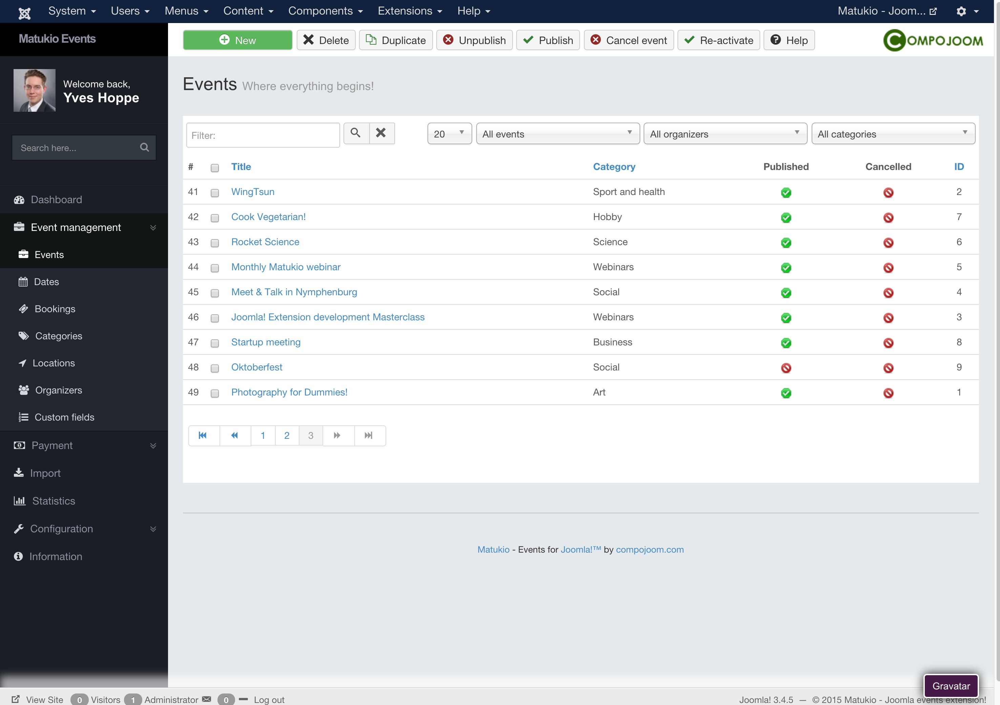

# The events overview (Administrator)

Event Management -> Events

This is one of the main pages of Matukio Events. Here you can add new events or manage existing ones. Most of the buttons on the top are self explaining.

> Please create a category first!

Events and dates are separated in Matukio. This is the reason that in the event-list no begin / end or booking count is displayed. 

In Matukio you can have multiple dates for a single event. You can even have recurring events with their own bookings.